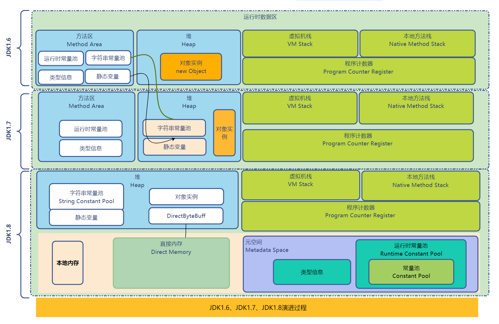

# jvm内存模型

[toc]

### 前言

JVM 运行时数据结构图：  

**jvm内存模型包括：**

- 程序计数器（Program Counter Register）
- JVM 栈（Java Virtual Machine Stack）
- 本地方法栈(Native method stack)
- 方法区(Method area)
- 堆(Heap)

### 程序计数器（Program Counter Register）

每一条JVM线程都有自己的程序计数器（pc寄存器） 

在任意时刻，一条 JVM 线程只会执行一个方法的代码。该方法称为该线程的当前方法（Current Method）。  

如果该方法是 java 方法，程序计数器保存JVM中 下一条被执行指令的”地址”  

如果该方法是 native，程序计数器是undefined。  

此区域是唯一一个不会出现OutOfMemoryError的内存区域。

### JVM 栈（Java Virtual Machine Stack）

每一个JVM线程都有自己的java虚拟机栈，用来保存栈帧。
栈帧里面保存了局部变量表、操作数栈、返回地址

#### 栈帧（stack frame）

当虚拟机调用一个方法的时候,虚拟机会根据class文件信息创建指定大小的栈帧,并把栈帧压入虚拟机栈，放方法执行结束的时候，栈帧就消失。

每一个栈帧都有自己的局部变量表（Local Variables）、操作数栈（Operand Stack）、动态链接、返回地址。

*   **局部变量数组(Local variable array)**  
    每个栈帧内部都包含一组称为局部变量表（Local Variables）的变量列表。栈帧中局部变量表的长度由编译期决定。  
    局部变量使用索引来进行定位访问，第一个局部变量的索引值为零，局部变量的索引值是从零至小于局部变量表最大容量的所有整数。  
    Java 虚拟机使用局部变量表来完成方法调用时的参数传递，当一个方法被调用的时候，它的参数将会传递至从 0 开始的连续的局部变量表位置上。特别地，当一个实例方法被调用的时候，第 0 个局部变量一定是用来存储被调用的实例方法所在的对象的引用（即 Java 语言中的“this”关键字）。后续的其他参数将会传递至从 1 开始的连续的局部变量表位置上。
*   **操作数栈(Operand stack)**  
    每一个栈帧内部都包含一个称为操作数栈（Operand Stack）的后进先出（Last-In-First-Out，LIFO）栈。栈帧中操作数栈的长度由编译期决定。  
    操作数栈所属的栈帧在刚刚被创建的时候，操作数栈是空的。Java 虚拟机提供一些字节码指令来从局部变量表或者对象实例的字段中复制常量或变量值到操作数栈中，也提供了一些指令用于从操作数栈取走数据、操作数据和把操作结果重新入栈。在方法调用的时候，操作数栈也用来准备调用方法的参数以及接收方法返回结果。
*   **动态链接（Dynamic Linking）**  
    每个栈帧都有一个运行时常量池的引用。这个引用指向栈帧当前运行方法所在类的常量池。通过这个引用支持动态链接（dynamic linking）。  
    C/C++ 代码一般被编译成对象文件，然后多个对象文件被链接到一起产生可执行文件或者 dll。在链接阶段，每个对象文件的符号引用被替换成了最终执行文件的相对偏移内存地址。在 Java中，链接阶段是运行时动态完成的。  
    当 Java 类文件编译时，所有变量和方法的引用都被当做符号引用存储在这个类的常量池中。符号引用是一个逻辑引用，实际上并不指向物理内存地址。JVM 可以选择符号引用解析的时机，一种是当类文件加载并校验通过后，这种解析方式被称为饥饿方式。另外一种是符号引用在第一次使用的时候被解析，这种解析方式称为惰性方式。无论如何 ，JVM 必须要在第一次使用符号引用时完成解析并抛出可能发生的解析错误。绑定是将对象域、方法、类的符号引用替换为直接引用的过程。绑定只会发生一次。一旦绑定，符号引用会被完全替换。如果一个类的符号引用还没有被解析，那么就会载入这个类。每个直接引用都被存储为相对于存储结构（与运行时变量或方法的位置相关联的）偏移量。
*   **方法正常调用完成**  
    在这种场景下，当前栈帧承担着回复调用者状态的责任，其状态包括调用者的局部变量表、操作数栈和被正确增加过来表示执行了该方法调用指令的程序计数器等。使得调用者的代码能在被调用的方法返回并且返回值被推入调用者栈帧的操作数栈后继续正常地执行。
*   **方法异常调用完成**  
    方法异常调用完成是指在方法的执行过程中，某些指令导致了 Java 虚拟机抛出异常，并且虚拟机抛出的异常在该方法中没有办法处理，或者在执行过程中遇到了 athrow 字节码指令显式地抛出异常，并且在该方法内部没有把异常捕获住。如果方法异常调用完成，那一定不会有方法返回值返回给它的调用者。

**局部变量表和操作数栈的工作流程**

命令：

iload_0    // push the int in local variable 0 onto the stack

iload_1    // push the int in local variable 1 onto the stack

iadd       // pop two ints, add them, push result

istore_2   // pop int, store into local variable 2

#### 异常情况

- 栈的stackoverflow：当前线程栈请求的空间大于jvm分配的空间，导致分配的栈空间不足。比如一个方法递归太深，栈是先入后出，递归太多的变量只能入栈儿不能出栈导致内存溢出。

- 栈的outofmemory：线程过多，没有足够的空间为新线程创建栈。

### 本地方法栈(Native method stack)  

本地方法栈指用非java语言实现的方法

**什么时候用到本地方法栈？**

在和底层交互的时候时用到，比如操作系统或某些硬件。

### 方法区(Method area)

- 方法区主要保存的是类的信息：

①类（class） ②静态变量（static变量） ③静态方法 ④常量和 ⑤成员方法。

- 方法区是所有线程共享的，所以访问方法区信息的方法必须是线程安全的。

- 方法区是一个 JVM 规范，永久代与元空间都是其一种实现方式。

**Java 方法区异常：**

OutOfMemoryError： 如果方法区的内存空间不能满足内存分配请求，那Java虚拟机将抛出一个OutOfMemoryError异常。

#### 运行时常量池(Runtime constant pool)  

运行时常量池是每一个类或接口的常量池（Constant_Pool）的运行时表现形式，它包括了若干种常量：编译器可知的数值字面量到必须运行期解析后才能获得的方法或字段的引用。

简而言之，当一个方法或者变量被引用时，JVM通过运行时常量区来查找方法或者变量在内存里的实际地址。

运行时常量池是方法区的一部分。每一个运行时常量池都分配在JVM的方法区中，在类和接口被
加载到JVM后，对应的运行时常量池就被创建。  

**在创建类和接口的运行时常量池时，可能会遇到的异常：**

OutOfMemoryError：当创建类和接口时，如果构造运行时常量池所需的内存空间超过了方法区所能提供的最大内存空间后就会抛出OutOfMemoryError

### 堆(Heap)

堆主要用来存储对象，是内存回收的主要区域。现代的垃圾收集器基本都是采用分代收集算法，其主要的思想是针对不同类型的对象采取不同的垃圾回收算法。根据分代算法可以将堆分成年轻代和老年代。新生代又可被分为：Eden、From Survior、To Survior。不同的区域存放具有不同生命周期的对象,使用不同的垃圾回收算法，

####  新生代

新生代的内存结构：

  - 伊甸区
  - 幸存者区1
  - 幸存者区1

####  老年代

新生代中的对象熬过15次垃圾回收就会进入老年代

老年代和年轻代区别

  - 垃圾收集算法不同
    - 新生代使用修改过的复制算法
    - 老年代使用标记-清楚或者标记整理算法
    
  - 存储的对象不同
    
    - 新生代保存的是新建的对象，老年代保存长期存活的对象 

#### 异常情况

outofmemory：对象过多

### JVM参数与联想记忆

以-X开头的都是非标准的(这些参数并不能保证在所有的JVM上都被实现)，而且如果在新版本有什么改动也不会发布通知

以-XX开头的都是不稳定的并且不推荐在生产环境中使用。这些参数的改动也不会发布通知。

1. -Xms，ms看做的memory size的缩写，就是初始堆大小

2. Xmx , maximum memory size，x代表最大，所以就最大堆内存

3. -Xss, ss就是stack size的缩写，所以是用来代表线程栈的大小

4. -Xmn,n代表是new generation(新生代),所以mn就是用来指定新生代的堆内存空间大小

5. -XX:PermSize 设置持久区的大小，在jdk 8中已经被metaspace取代

6. -XX:MaxPermSize 设置持久区最大值，在jdk 8中已经被metaspace取代

### 内存异常排查方法：

先通过top命令找到消耗内存最高的进程id

在通过top -hp命令查看这个进程的所有线程，记录下异常线程的线程id

通过jstack命令打印线程信息，找到刚刚记录线程id对应的线程信息去分析（包括线程数量、是否存在死锁、资源竞争情况和线程的状态），不过这个线程id在jstack中是16进制的

- top pid
- top -Hp pid
- jstack -l pid
- jmap -heap pid
- jmap -dump:format=b,file=D:\heap.bin pid
- mat 打开heap.bin，进入histrogram

参考资料：

 [Java JVM——9.方法区 - 城北有个混子 - 博客园 (cnblogs.com)](https://www.cnblogs.com/ruoli-0/p/14275977.html#_label2_0) 

