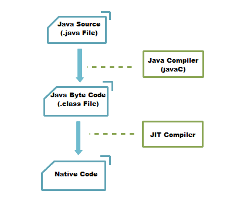

# 执行引擎（Execution Engine）

  

执行引擎主要用来执行Java生成.class的字节码，解析成各种cpu所能执行的二进制指令。。

## 解释执行和编译执行

解释执行：将字节码一行一行地翻译为机器码执行。执行起来会比较慢

编译执行：将字节码一次性翻译为机器码后执行。编译慢，执行快 

## 即时（Just-In-Time)编译器：

即时编译器被引入用来弥补解释执行的缺点。

它把热点代码编译成机器语言，编译慢，执行快。

通过这种方法（JIT），Hotspot 虚拟机将权衡下面两种时间消耗：将字节码编译成本地代码需要的额外时间和解释执行字节码消耗更多的时间。

