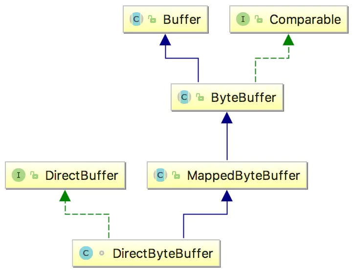
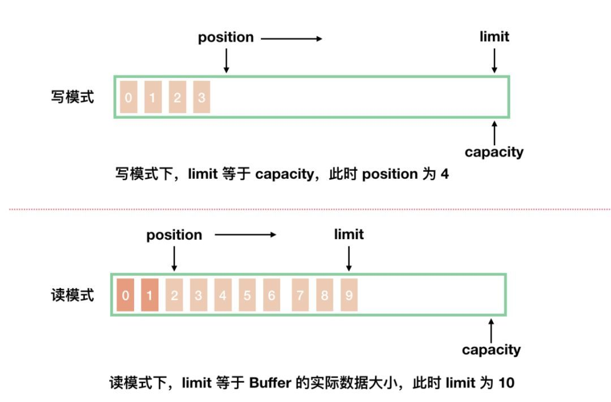
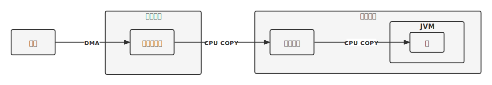

[TOC]

# Java NIO

Java NIO（New IO）是从Java 1.4版本开始引入的一个新的IO API，可以替代标准的Java IO API。NIO与原来的IO有同样的作用和目的，但是使用的方式完全不同，NIO支持面向缓冲区的、基于通道的IO操作。NIO将以更加高效的方式进行文件的读写操作。

Netty主要是基于IO多路复用，JAVA NIO库提供了IO多路复用的实现，所以本文主要讲述NIO和IO多路复用的相关知识。

## Java NIO的组件

NIO 有三大核心组件： Selector 选择器、 Channel 管道、 buffer 缓冲区。

### Channel 通道

Channel代表应用程序到实体的开放连接，这个实体可以是硬件，文件，网络套接字，或者程序组件，可以通过它读取和写入数据。

相对于传统的Java IO里的Stream，有什么不同？

- Channel可以同时支持读和写，而Stream只能支持单向的读或写（所以分成InputStream和OutputStream）

- Channel支持异步读写，Stream通常只支持同步

下面列举了JDK中比较重要的实现方式：

    FileChannel: 从文件中读写数据。
    DatagramChannel : 能通过UDP读写网络中的数据。
    SocketChannel: 能通过TCP读写网络中的数据。
    ServerSocketChannel :可以监听新进来的TCP连接，像Web服务器那样。对每一个新进来的连接都会创建一个SocketChannel。

### Buffer 缓冲区

  

Buffer是在数据传输时，在内存里开辟的一块临时保存数据的区域 。我们可以把通道中读出的数据写入缓冲区，也可以把Buffer中的数据写入通道。

```java
 int bytesRead = inChannel.read(bufer);
```

```java
int bytesWritten = inChannel.write(bufer); 
```

#### Buffer的属性

缓冲区的主要目的是把数据化零为整，以减少读写次数。

  

- 容量（Capacity）

作为一块内存，buffer有一个固定的大小，叫做capacit（容量）。也就是最多只能写入容量值得字节，整形等数据。一旦buffer写满了就需要清空已读数据以便下次继续写入新的数据。

- 位置（Position）

当写入数据到Buffer的时候需要从一个确定的位置开始，默认初始化时这个位置position为0，一旦写入了数据比如一个字节，整形数据，那么position的值就会指向数据之后的一个单元，position最大可以到capacity-1.

当从Buffer读取数据时，也需要从一个确定的位置开始。buffer从写入模式变为读取模式时，position会归零，每次读取后，position向后移动。

- 上限（Limit）

在写模式，limit的含义是我们所能写入的最大数据量，它等同于buffer的容量。

一旦切换到读模式，limit则代表我们所能读取的最大数据量，他的值等同于写模式下position的位置。换句话说，您可以读取与写入数量相同的字节数（限制设置为写入的字节数，由位置标记）。

##### DirectByteBuffer

  

直接内存（堆外内存）字节缓冲区：IO时相对ByteBuffer少了一次内存复制。

为什么需要DirectByteBuffer？

操作系统IO时需要一个稳定的连续的字节空间，但是java堆内的字节空间会随着GC的进行而移动，如果操作 系统读取堆上的空间，就会出错。

需要注意的是DirectBuffer的创建是比较耗时的，所以在一些高性能的中间件或者应用下一般会做一个对象池，用于重复利用DirectBuffer。

###  Selector

Selector 的英文含义是 “ 选择器 ” ，也可以称为 “ 多路复用器 ”。它允许一个单独的线程来监听多个通道。

使用时需要先将通道注册到选择器上，再用一个单独的线程调用选择器的方法select()，此时选择器会监视注册在上面的通道，如果有通道处于就绪状态（发生读或写事件），此方法就会返回这些通道的集合，让应用程序进行响应的IO操作。

```java
//设置Channel 必须是非阻塞的
channel.configureBlocking(false);
//注册
SelectionKey key = channel.register(selector, SelectionKey.OP_READ | SelectionKey.OP_WRITE);
//阻塞监听IO事件
Set<SelectionKey> keys = selector.selectedKeys();
```

注册后会创建一个 **SelectionKey** 。 SelectionKey 持有Channel与监听的事件。 

这些事件有:
SelectionKey.OP_CONNECT 连接事件
SelectionKey.OP_ACCEPT 接受事件
SelectionKey.OP_READ, 表示 channel 可读， 比如内核缓冲区有尚未被应用读取的数据，会通知应用程序从读取缓冲区进行读取 
SelectionKey.OP_WRITE,  当一个channel 准备好进行写入操作，比如内核缓冲区已满，在发送了部分数据之后腾出了一些空间，会通知应用程序进行写入

## 零拷贝

NIO 中的 Channel（通道）相当于操作系统中的内核缓冲区， Buffer 就相当于操作系统中的用户空间缓冲区。零拷贝在 NIO 这里重要的是两个实现：

- FileChannel.map() : 基于内存映射 **mmap** 方式一种实现。该方法可以在一个打开的文件和MappedByteBuffer之间建立一个虚拟内存映射，MappedByteBuffer继承于ByteBuffer，该缓冲器的存的是一个文件的内存映射区域 

  ```java
  public void main(String[] args){
      try {
          FileChannel readChannel = FileChannel.open(Paths.get("./a.txt"), StandardOpenOption.READ);
          FileChannel writeChannel = FileChannel.open(Paths.get("./b.txt"), StandardOpenOption.WRITE, StandardOpenOption.CREATE);
          MappedByteBuffer data = readChannel.map(FileChannel.MapMode.READ_ONLY, 0, 1024 * 1024 * 40);
         	//数据传输
          writeChannel.write(data);
          readChannel.close();
          writeChannel.close();
      }catch (Exception e){
          System.out.println(e.getMessage());
      }
  }
  ```

- FileChannel.transferTo()、 FileChannel.transferFrom()  : 通过调用 **sendfile** 方式实现的零拷贝。

  ```java
  public void main(String[] args) {
      try {
          FileChannel readChannel = FileChannel.open(Paths.get("./cscw.txt"), StandardOpenOption.READ);
          FileChannel writeChannel = FileChannel.open(Paths.get("./siting.txt"), StandardOpenOption.WRITE, StandardOpenOption.CREATE);
          long len = readChannel.size();
          long position = readChannel.position();
          //数据传输
          readChannel.transferTo(position, len, writeChannel);
          //效果和transferTo 一样的
          //writeChannel.transferFrom(readChannel, position, len, );
          readChannel.close();
          writeChannel.close();
      } catch (Exception e) {
          System.out.println(e.getMessage());
      }
  }
  ```

## 实现HTTP服务器

```java
import java.io.IOException;
import java.net.InetSocketAddress;
import java.nio.ByteBuffer;
import java.nio.CharBuffer;
import java.nio.channels.SelectionKey;
import java.nio.channels.Selector;
import java.nio.channels.ServerSocketChannel;
import java.nio.channels.SocketChannel;
import java.nio.charset.Charset;
import java.util.Iterator;

public class NioServer {
    private String ip;
    private int port;
    private Selector selector;

    public NioServer(String ip, int port) {
        this.ip = ip;
        this.port = port;
    }

    public void startListen() throws IOException {
        selector = Selector.open();
        ServerSocketChannel serverChannel = ServerSocketChannel.open();
        serverChannel.configureBlocking(false);
        //先注册一个 OP_ACCEPT 事件, 然后在 OP_ACCEPT 到来后, 再将这个 Channel 的 OP_READ 注册到 Selector 中.
        serverChannel.register(selector, SelectionKey.OP_ACCEPT);
        serverChannel.bind(new InetSocketAddress(ip, port));
        while (true) {
            int result = selector.selectNow();
            if (result == 0) {
                continue;
            }
            // 获取 I/O 操作就绪的 SelectionKey
            Iterator<SelectionKey> it = selector.selectedKeys().iterator();
            while (it.hasNext()) {
                SelectionKey key = it.next();
                if (key.isAcceptable()) {
                    accept(key);
                } else if (key.isReadable()) {
                    read(key);
                } else if (key.isWritable()) {
                    write(key);
                } else {
                    System.out.println("Unknow selector type");
                }
                // 获取一个SelectionKey后, 就要将它删除, 表示我们已经对这个IO事件进行了处理.
                it.remove();
            }
        }
    }

    private void accept(SelectionKey key) throws IOException {
        System.out.println("Receive connection");
        ServerSocketChannel serverSocketChannel = (ServerSocketChannel) key.channel();
        SocketChannel channel = serverSocketChannel.accept();

        if (channel != null) {
            channel.configureBlocking(false);
            channel.register(selector, SelectionKey.OP_READ);
        }
        System.out.println("Connection end");
    }

    private void read(SelectionKey key) throws IOException {
        System.out.println("Start read");
        SocketChannel channel = (SocketChannel) key.channel();
        ByteBuffer buffer = ByteBuffer.allocate(64);
        boolean hasContent = false;
        //这里的判断条件不能是不等于-1，因为channel一直都在，只是在数据被读完后里面为空，返回的长度是0.用-1判断会无限循环无法退出
        while (channel.read(buffer) > 0) {
            buffer.flip(); //切换为读模式
            CharBuffer cb = Charset.forName("UTF-8").decode(buffer);
            System.out.print(cb.toString());
            buffer.clear();
            hasContent = true;
        }
        if (hasContent) {
            //设置interestOps，用于写响应
            key.interestOps(SelectionKey.OP_WRITE);
        } else {
            channel.close();
        }
        System.out.println("Read end");
    }

    private void write(SelectionKey key) throws IOException {
        System.out.println("Start write");
        SocketChannel channel = (SocketChannel) key.channel();
        String resText = getResponseText();
        ByteBuffer buffer = ByteBuffer.wrap(resText.getBytes());
        while (buffer.hasRemaining()) {
            channel.write(buffer);
        }
        channel.close();
        System.out.println("End write");
    }

    private String getResponseText() {
        StringBuffer sb = new StringBuffer();
        sb.append("HTTP/1.1 200 OK\n");
        sb.append("Content-Type: text/html; charset=UTF-8\n");
        sb.append("\n");
        sb.append("<html>");
        sb.append("  <head>");
        sb.append("    <title>");
        sb.append("      NIO Http Server");
        sb.append("    </title>");
        sb.append("  </head>");
        sb.append("  <body>");
        sb.append("    <h1>Hello World!</h1>");
        sb.append("  </body>");
        sb.append("</html>");
        return sb.toString();
    }

    public static void main(String[] args) {
        NioServer server = new NioServer("127.0.0.1", 8080);
        try {
            server.startListen();
        } catch (IOException e) {
            e.printStackTrace();
        }
    }
}
```

## 空轮询BUG

官方把问题归结于于linux的epoll。 **poll和epoll对于突然中断的连接socket会对返回的eventSet事件集合置为POLLHUP** ，也可能是POLLERR，eventSet事件集合发生了变化，这就可能导致Selector会被唤醒。但是此时并没有发生感兴趣的事件，所以select()返回的事件数目为0。

SelectionKey中根本没有定义异常事件类型，底层的异常事件无法映射为上层能够处理的事件。 

jdk认为linux的epoll告诉我事件来了，但是jdk没有拿到任何事件(READ、WRITE、CONNECT、ACCPET)。

 [Bug ID: JDK-6595055 orbd consumes 100% cpu (java.com)](https://bugs.java.com/bugdatabase/view_bug.do?bug_id=6595055) 

