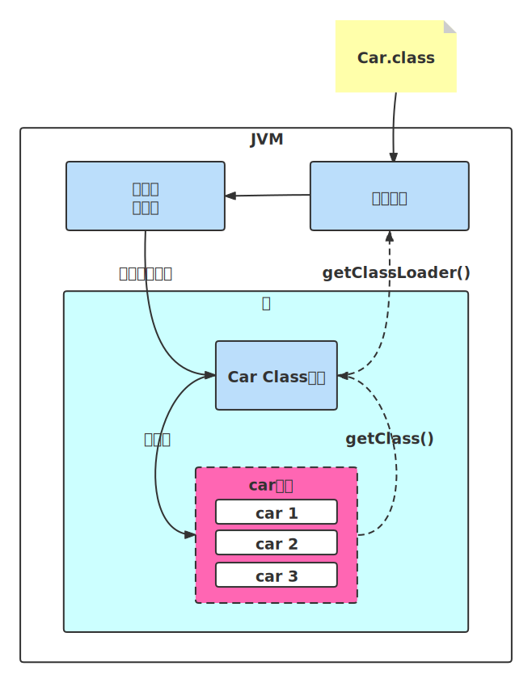

# 反射

## 类、Class实例、实例

编译器编译之后，会为每个类生成对应的.class文件，这个就是JVM可以加载执行的字节码。

运行时期间，当我们需要实例化任何一个类时，JVM会首先尝试看看在内存中是否有这个类，如果有，那么会直接创建类实例；如果没有，那么就会根据类名去加载这个类，

当加载一个类，或者当加载器(class loader)的defineClass()被JVM调用，便会为这个类产生一个java.lang.Class类的实例，用来表达这个类。

该类的所有实例都共同拥有着这个Class实例，而且是唯一的。 

​	

## 优缺点

优点：可以通过类名创建实例，增加程序灵活性，可以实现动态代理，spring的ioc和aop

缺点：

可以访问私有方法，method.invoke(obj, args)

效率低。JIT及时编译器无法优化。JIT及时编译器会把热点代码编译成机器码，执行的更快。


## Class实例的生成方式

1.Class.forName("类名字符串") （注意：类名字符串必须是全称，包名+类名）；
2.类名.class；
3.实例对象.getClass()；

## DEMO

```java
public class Car {
    String name = "mycar";
    
    public Car() {
    }

    public String getName() {
        return name;
    }

    public static void main1(String[] args) throws Throwable {
        Class clz = Class.forName("com.coocaa.tvpi.admin.config.Car");
        MethodHandles.Lookup lookup = MethodHandles.lookup();
        MethodType methodType = MethodType.methodType(String.class);
        MethodHandle handle = lookup.findVirtual(Car.class, "getName", methodType);
        String name = (String) handle.invoke(clz.newInstance());
        System.out.println(name);
    }

    public static void main(String[] args) throws Exception {
        Class clz = Class.forName("com.coocaa.tvpi.admin.config.Car");
        clz.newInstance();
        Method getNameMethod = clz.getMethod("getName");
        Object car = clz.newInstance();
        System.out.println(getNameMethod.invoke(car));
    }
}
```

Method.invoke内部调用了MethodAccessor.invoke

其实 MethodAccessor 是一个接口，定义了方法调用的具体操作，而它有三个具体的实现类：

- sun.reflect.DelegatingMethodAccessorImpl
- sun.reflect.MethodAccessorImpl
- sun.reflect.NativeMethodAccessorImpl

 MethodAccessor.invoke 方法内部有两种实现方式，一种是 native 原生的实现方式，一种是 Java 实现方式，这两种各有千秋。而为了最大化性能优势，JDK 源码使用了代理的设计模式去实现最大化性能。 

Native 版本一开始启动快，但是随着运行时间边长，速度变慢。Java 版本一开始加载慢，但是随着运行时间边长，速度变快。正是因为两种存在这些问题，所以第一次加载的时候我们会发现使用的是 NativeMethodAccessorImpl 的实现，而当反射调用次数超过 15 次之后，则使用 MethodAccessorGenerator 生成的 MethodAccessorImpl 对象去实现反射。

## java.lang.invoke.MethodHandle与java.lang.reflect.Method

Reflection和MethodHandle机制本质上都是在模拟方法调用，但是Reflection是在模拟Java代码层次的方法调用，而MethodHandle是在模拟字节码层次的方法调用。
在MethodHandles.Lookup上的三个方法findStatic()、findVirtual()、findSpecial()正是为了对应于invokestatic、invokevirtual & invokeinterface和invokespecial这几条字节码指令的执行权限校验行为，而这些底层细节在使用Reflection API时是不需要关心的。

Reflection中的java.lang.reflect.Method对象远比MethodHandle机制中的java.lang.invoke.MethodHandle对象所包含的信息来得多。前者是方法在Java一端的全面映像，包含了方法的签名、描述符以及方法属性表中各种属性的Java端表示方式，还包含有执行权限等的运行期信息。而后者仅仅包含着与执行该方法相关的信息。用开发人员通俗的话来讲，Reflection是重量级，而MethodHandle是轻量级。

由于MethodHandle是对字节码的方法指令调用的模拟，那理论上虚拟机在这方面做的各种优化（如方法内联），在MethodHandle上也应当可以采用类似思路去支持（但目前实现还不完善）。而通过反射去调用方法则不行。


MethodHandle的好处是：

调用 invoke() 已经被JVM优化，类似直接调用一样。
性能好得多，类似标准的方法调用。
当我们创建MethodHandle 对象时，实现方法执行权限检测(如2中的MethodHandles.Lookup上的三个方法findStatic()、findVirtual()、findSpecial())，而不是调用invoke() 时。

