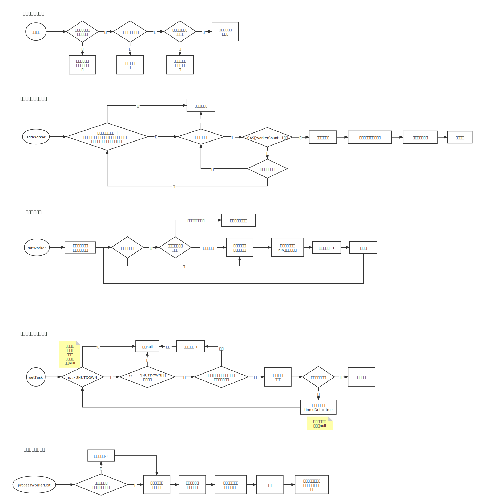

[TOC]

# 线程池

**为什么要使用线程池？**

主要是为了重复利用线程资源，减少系统在创建和销毁线程上所花的时间和开销；同时也可以限制资源过多，防止出现OOM或执行效率下降

## Executor线程池

### 利用Executors工具类创建线程池

  - Executors.newFixedThreadPool(int)

    创建一个最大规模固定的线程池，如果当前线程不够用且没有超过线程池限制数量，则创建新的线程。如果线程池已满，则会将任务放入等待队列。

  - Executors.newCachedThreadPool

    无限容量（integer.maxvalue）的线程池，它会根据需要创建新线程，自动扩容，基于同步队列实现，如果同步队列没有任务正在移除，那么久加入失败，扩容队列。

  - Executors.newSingleThreadExecutor

    创建一个单线程的线程池，确保任务串行

  - Executors.newScheduledThreadPool

    创建一个固定大小的线程池，以延迟或者固定周期的方式执行，类似于定时器

### 如何执行任务

  - e.execute(Runnable r) :执行任务无返回值
  - e.submit(Runnable r) :执行任务返回Future<?> ,实际上是null
  -  e.submit(Runnable r,T result) : 执行任务返回Future<T>
  -  e.submit(Callable c) :执行返回Future<?>

### 线程池工作队列

  - ArrayBlockingQueue
    - 通过offer方法添加数据，在添加数据时采用ReentrantLock 加锁
    - 采用数组形式存储数据。如果队列已满，则无法添加。
  - LinkedBlockingDeque
    - 采用单项链表，添加与移除元素速度快，使用时最好指定链表长度，减少内存溢出。
  - SynchronousQueue
    - 默认非公平的无界队列，每个添加操作都要等待队列内的元素被消费
      - 同步队列，生产者和消费者互相等待，牵手是一起离开

### 拒绝策略

  异常策略

  调用者线程执行策略

  丢弃新任务策略

  丢弃老任务策略

### 线程异常

  - try catch捕获异常
  - future.get()接收异常后，再捕获异常

### ThreadPoolExecutor工作流程

  

## Fork/Join线程池

- 主旨

  - 将大任务分成若干小任务（fock），之后再并行对这些小任务进行计算，最终汇总这些任务的结果（join）。

  - 特点是少量线程完成大量任务，一般用于非阻塞的，能快速处理的业务，或阻塞时延比较少的

- 应用

  并行流和CompletableFuture都是用的fockjoin线程池

