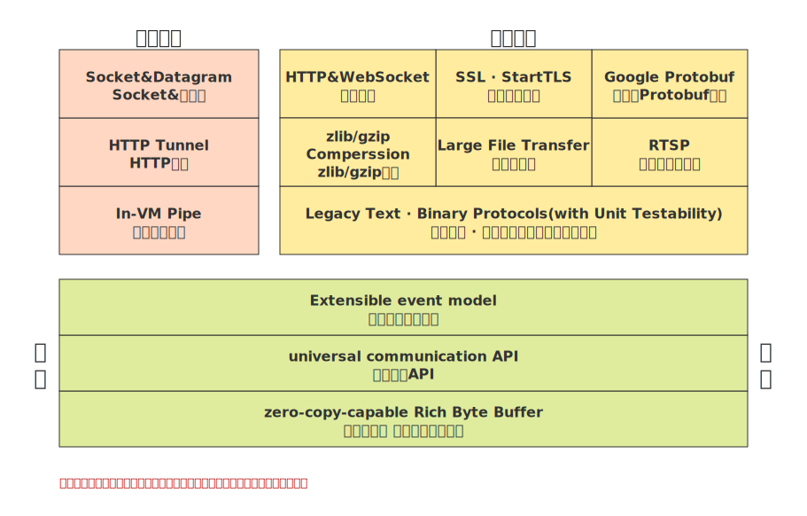
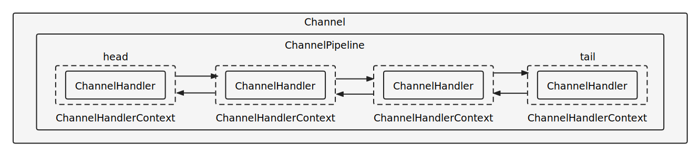

[TOC]

​	

# Netty

学习Netty时需要回顾的知识：

- JAVA NIO
- IO模型
- C/C++ Socket函数

## 什么是Netty

**Netty**是 一个**基于JAVA NIO、异步事件驱动**的网络应用程序框架，用于**快速开发可维护的高性能协议服务器和客户端**。

身边到处都是Netty影子，如Cassandra、Spark、Hadoop、RocketMQ、ElasticSearch、Dubbo、Spring WebFlux、Lettuce


## 为什么不直接使用Java NIO

1. 高性能。
   1. ByteBuf实现了零拷贝、集成了高性能序列化协议。
   2. 提供了池化的Buffer，类似于线程池或数据库连接池的思想，避免了Buffer频繁的创建和释放带来的性能低效及GC压力 
2. 高可靠性。Netty解决了NIO存在BUG
3. 高扩展性。使用责任链模式集成，以链表的形式串联各个处理器，方便扩展的同时，降低的不同业务耦合度 。类似于Servlet的过滤器。
4. 提高网络编程效率

   1. 内部实现了许多网络协议，例如HTTP、WebSocket、Google Protobuf、SSL为我们节省了开发成本

   2. 对于常见的网络问题，都有现成的API解决。比如断连重连、网络闪断、拆包粘包、 网络拥塞等

   4. 封装了NIO的很多细节，使用更简单。


## 组件

## ByteBuf

字节数据容器，缓冲区的主要目的是把数据化零为整，以减少读写次数。

**为什么不用Java NIO ByteBuffer？**

- ByteBuffer长度固定，越界会抛出异常，而ByteBuf会自动扩容；
- ByteBuffer读写的时候需要手工调用flip()和rewind()等函数修改指针position，使用者必须小心谨慎地处理这些API,否则很容易导致程序处理失败；
- ByteBuffer的API功能有限，Netty提供了许多ByteBuf的扩展类，支持池化和零拷贝。

### Channel 通道

Netty是事件驱动，而事件的生产者就是Channel。它是一个数据通道，Netty中的选择器会监听所有通道所发生事件，并调用对应的事件处理器处理。

Channel 提供的方法：

- 当前网络连接的通道的状态

  ```
  boolean isOpen(); //如果通道打开，则返回true
  boolean isRegistered();//如果通道注册到EventLoop，则返回true
  boolean isActive();//如果通道处于活动状态并且已连接，则返回true
  boolean isWritable();//当且仅当I/O线程将立即执行请求的写入操作时，返回true。
  ```

- 网络连接的配置参数 

  ```
  ChannelConfig config = channel.config();
  Integer soBackLogConfig = config.getOption(ChannelOption.SO_BACKLOG);
  ```

- 网络 I/O 操作(如建立连接，读写，绑定端口)，

  - 写操作

  ```
  @Override
  public void channelRead(ChannelHandlerContext ctx, Object msg) throws Exception {
  	//从服务端写消息发送到客户端 异步
      ctx.channel().writeAndFlush(Unpooled.copiedBuffer("这波啊，这波是肉蛋葱鸡~", CharsetUtil.UTF_8));
  }
  ```

  - 连接操作

  ```
  ChannelFuture connect = channelFuture.channel().connect(new InetSocketAddress("127.0.0.1", 6666));//一般使用启动器，这种方式不常用
  ```

- NioSocketChannel，异步的客户端 TCP Socket 连接。
- NioServerSocketChannel，异步的服务器端 TCP Socket 连接。
- NioDatagramChannel，异步的 UDP 连接。

### Selector

Netty 基于 Selector 对象实现 I/O 多路复用，通过 Selector 一个线程可以监听多个连接的 Channel 事件。

当向一个 Selector 中注册 Channel 后，Selector 内部的机制就可以自动不断地查询(Select) 这些注册的 Channel 是否有已就绪的 I/O 事件（例如可读，可写，网络连接完成等），这样程序就可以很简单地使用一个线程高效地管理多个 Channel 。

### NioEventLoopGroup

NioEventLoopGroup，主要管理 eventLoop 的生命周期，可以理解为一个线程池，内部维护了一组线程，每个线程(NioEventLoop)负责处理多个 Channel 上的事件，而一个 Channel 只对应于一个线程。

### NioEventLoop

​	

Netty的事件循环EventLoop是一个不断循环着执行读取就绪事件、处理事件、运行任务队列这三个操作的一个线程。 

**重要的成员变量**

- private Selector selector;
  作为NIO框架的Reactor线程，NioEventLoop需要处理网络IO事件，因此它需要有一个多路复用器，即Java NIO的Selector对象；

- private SelectedSelectionKeySet selectedKeys;
  每次select操作选出来的有事件就绪的SelectionKey集合，在NioEventLoop的run方法中会处理这些事件；

- private volatile Thread thread;
  即每个NioEventLoop绑定的线程，它们是一对一的关系，一旦绑定，在整个生命周期内都不会改变；

- private final EventExecutorGroup parent;
  即当前的NioEventLoop所属的EventExecutorGroup；

- private final Queue<Runnable> taskQueue;
  NioEventLoop中三大队列之一，是一个优先级队列（内部其实是一个按照任务的下次执行时间排序的小顶堆），用于保存定时任务，当检测到定时任务需要被执行时，会将任务从scheduledTaskQueue中取出，放入taskQueue；

- PriorityQueue<ScheduledFutureTask<?>> scheduledTaskQueue; 
  NioEventLoop中三大队列之一，用于保存需要被执行的任务。

- private final Queue<Runnable> tailTasks;
  NioEventLoop中三大队列之一，用于存储当前或下一次事件循环结束后需要执行的任务；

**如何运行**？

NioEventLoop 中维护的线程启动时会调用 NioEventLoop 的 run 方法，执行以下操作：

1. select() 监听并获取channel中就绪的IO事件，比如accept、connect、read、write
2. processSelectedKeys() 处理发生的IO事件，执行事件处理器
3. runAllTasks() 运行**任务队列**中的普通任务和定时任务，比如register0、bind0、心跳等任务

**Netty中的线程是何时启动的**？

启动时机有两个，一个是在服务端启动的过程中触发，另一个是在新连接接入的时候，但是最终都是调用**ThreadPerTaskExecutor**类的**execute(Runnable command)** 方法，通过线程工厂来创建一个线程，然后调用线程的**start()** 方法启动线程，当线程启动后，又会回调传入的 Runnable 任务的 run()方法，在任务的 run()方法中通过调用**SingleThreadEventExecutor.this.run()** 来调用 NioEventLoop 的 run()方法，这样就启动了 NioEventLoop。

**Netty 中的线程是如何实现串行无锁化的？**

每个 NioEventLoop 中只包含一个线程，而每个 channel 只会绑定在一个 NioEventLoop 上，一但绑定上了，后面这个 channel 的所有 IO 操作都会交由这个 NioEventLoop 线程来处理，因此不会出现多个 NioEventLoop 线程来争夺处理 channel 的情况，因此说在 NioEventLoop 上，所有的操作都是串行处理的，不存在锁的竞争，即串行无锁化。

**既然有多个 NioEventLoop 线程，那么这个时候应该从线程组中选择哪一个 NioEventLoop 来和客户端 channel 绑定呢 ?**

Netty 的做法是：轮询，第一个客户端 channel 来了后，取线程组中的第一个线程，即 children 数组中的第一个元素；然后当第二个线程来时，取数组中的第二个元素，以此类推，循环的从 children 数组中取 NioEventLoop。这个算法很简单，如何实现呢？就是每来一个客户端 channel，先获取计数器的值，然后用计数器的值对数组取模，然后再将计数器加一。

### ChannelHandler

ChannelHandler 是一个接口，用于处理IO事件，并将其转发到其 ChannelPipeline(业务处理链)中的下一个处理程序。

ChannelHandler 本身并没有提供很多方法，我们平时主要接触它的实现类类：

-  **ChannelInboundHandlerAdapter** ：入站处理器，处理源于外部的事件
  - 注册事件 fireChannelRegistered。
  - 连接建立事件 fireChannelActive。
  - 读事件和读完成事件 fireChannelRead、fireChannelReadComplete。
  - 异常通知事件 fireExceptionCaught。
  - 用户自定义事件 fireUserEventTriggered。
  - Channel 可写状态变化事件 fireChannelWritabilityChanged。
  - 连接关闭事件 fireChannelInactive。


-  **ChannelOutboundHandler** ：出站处理器，处理应用程序内部请求而触发的事件
  - 端口绑定 bind。
  - 连接服务端 connect。
  - 写事件 write。
  - 刷新时间 flush。
  - 读事件 read。
  - 主动断开连接 disconnect。
  - 关闭 channel 事件 close。

**具体应用：**

解码器 ：比如将二进制数据（例如ByteBuf ）转换为 Java 对象。

编码器：比如将 Java 对象转换为二进制数据。

协议处理器：如WebSocketServerProtocolHandler，处理握手

定义处理器：执行实际的业务逻辑，如鉴权、数据库增删改查。

**如何避免高耗时处理器对主线程的影响？**

1. 在处理器的类中定义新的线程池执行耗时任务

   ```
   static final EventExecutorGroup group=new DefaultEventExecutorGroup(16);
   ```

2. 在创建客户端或者服务器时，指定执行处理器的线程组。

   ```
   static final EventExecutorGroup group=new DefaultEventExecutorGroup(16);
   socketChannel.pipeline().addLast(group,new NettyServerHandler());
   ```


## ChannelFuture

在搭建HelloWord工程的时候，我们看到有一行这样的代码：

```
ChannelFuture channelFuture = bootstrap.connect("127.0.0.1", 6666);
```

很多操作都返回这个ChannelFuture对象，究竟这个ChannelFuture对象是用来做什么的呢？

ChannelFuture提供操作完成时一种异步通知的方式。一般在Socket编程中，等待响应结果都是同步阻塞的，而Netty则不会造成阻塞，因为ChannelFuture是采取类似观察者模式的形式进行获取结果。请看一段代码演示：

```
//添加监听器
channelFuture.addListener(new ChannelFutureListener() {
    //使用匿名内部类，ChannelFutureListener接口
    //重写operationComplete方法
    @Override
    public void operationComplete(ChannelFuture future) throws Exception {
        //判断是否操作成功    
        if (future.isSuccess()) {
            System.out.println("连接成功");
        } else {
            System.out.println("连接失败");
        }
    }
});
```

### ChannelHandlerContext

保存 Channel 相关的所有上下文信息，同时关联一个 ChannelHandler 对象。

### ChannelPipline（流水线）

​	

一个 Channel 包含了一个 ChannelPipeline，而 ChannelPipeline 中又维护了一个由 ChannelHandlerContext 组成的双向链表，并且每个 ChannelHandlerContext 中又关联着一个 ChannelHandler。

ChannelPipeline的内部实现类似于Servlet中的过滤器，用于处理或拦截 Channel 的入站事件和出站操作。

并通过调用 ChannelHandlerContext 中定义的事件传播方法。

例如 ChannelHandlerContext.fireChannelRead（Object）和 ChannelOutboundInvoker.write（Object）转发到其最近的处理程序。

注意, 如果我们捕获了一个事件, 并且想让这个事件继续传递下去, 那么需要调用 Context 相应的传播方法。例如:

```
public class MyInboundHandler extends ChannelInboundHandlerAdapter {
    @Override
    public void channelActive(ChannelHandlerContext ctx) {
        System.out.println("Connected!");
        ctx.fireChannelActive();
    }
}

public clas MyOutboundHandler extends ChannelOutboundHandlerAdapter {
    @Override
    public void close(ChannelHandlerContext ctx, ChannelPromise promise) {
        System.out.println("Closing ..");
        ctx.close(promise);
    }
}
```

注意事项： 

1. InboundHandler顺序执行，OutboundHandler逆序执行

2. InboundHandler之间传递数据，通过ctx.fireChannelRead(msg)

3. InboundHandler通过ctx.write(msg)，则会传递到outboundHandler

4. 使用ctx.write(msg)传递消息，Inbound需要放在结尾，在Outbound之后，不然outboundhandler会不执行；

​      但是使用channel.write(msg)、pipline.write(msg)情况会不一致，都会执行,那是因为channel和pipline会贯穿整个流。

5. outBound和Inbound谁先执行，针对客户端和服务端而言，客户端是发起请求再接受数据，先outbound再inbound，服务端则相反。

**读事件触发流程**

1. NioEventLoop.processSelectedKey(SelectionKey k, AbstractNioChannel ch)
2. NioSocketChannel.NioSocketChannelUnsafe.read()
3. ChannelPipeline.fireChannelRead(Object msg);
4. AbstractChannelHandlerContext.invokeChannelRead(AbstractChannelHandlerContext next, Object msg);
5. InBoundHandler.channelRead(ChannelHandlerContext ctx, Object msg)

### Bootstrap、ServerBootstrap

Bootstrap 意思是引导，一个 Netty 应用通常由一个 Bootstrap 开始，主要作用是配置整个 Netty 程序，串联各个组件。

Netty 中 Bootstrap 类是客户端程序的启动引导类，ServerBootstrap 是服务端启动引导类。

**服务器ServerBootstrap编码过程：**

```
1 设置reactor 线程
2 设置nio类型的channel
3 设置端口
4 设置通道参数
5 设置处理器流水线
6 绑定、监听服务器端口后
7 监听通道关闭事件
8 优雅关闭EventLoopGroup
```

**创建Netty服务端Ddmo：**

```java

    public static void main(String[] args) {
        NioEventLoopGroup boosGroup = new NioEventLoopGroup();
        NioEventLoopGroup workerGroup = new NioEventLoopGroup();
        final ServerBootstrap b = new ServerBootstrap();
        int port = 8080;
        try {
            //1 设置reactor 线程
            b.group(boosGroup, workerGroup);
            //2 设置nio类型的channel
            b.channel(NioServerSocketChannel.class);
            //3 设置监听端口
            b.localAddress(new InetSocketAddress(port));
            //4 设置通道参数
            b.option(ChannelOption.SO_KEEPALIVE, true);
            b.option(ChannelOption.ALLOCATOR, PooledByteBufAllocator.DEFAULT);
            //5 装配流水线
            b.childHandler(new ChannelInitializer<SocketChannel>() {
                //有连接到达时会创建一个channel
                protected void initChannel(SocketChannel ch) throws Exception {
                    ch.pipeline().addLast(new ProtobufDecoder());
                    ch.pipeline().addLast(new ProtobufEncoder());
                    // 在channel队列中添加一个handler来处理业务
                    ch.pipeline().addLast("serverHandler", serverHandler);
                }
            });
            // 6 开始绑定server，通过调用sync同步方法阻塞直到绑定成功
            ChannelFuture channelFuture = b.bind().sync();
            // 7 监听通道关闭事件，应用程序会一直等待，直到channel关闭
            ChannelFuture closeFuture = channelFuture.channel().closeFuture();
            closeFuture.sync();
        } catch (Exception e) {
            e.printStackTrace();
        } finally {
            // 8 优雅关闭EventLoopGroup，释放掉所有资源包括创建的线程
            workerGroup.shutdownGracefully();
            boosGroup.shutdownGracefully();
        }
    }
```

## 工作流程

结合上面的介绍的Netty Reactor模型，介绍服务端Netty的工作架构图：

  

服务端Netty Reactor工作架构图

server端包含1个Boss NioEventLoopGroup和1个Worker NioEventLoopGroup，NioEventLoopGroup相当于1个事件循环组，这个组里包含多个事件循环NioEventLoop，每个NioEventLoop包含1个selector和1个事件循环线程。

每个Boss NioEventLoop循环执行的任务包含3步：

- 1 轮询accept事件
- 2 处理accept I/O事件，与Client建立连接，生成NioSocketChannel，并将NioSocketChannel注册到某个Worker NioEventLoop的Selector上
- 3 处理任务队列中的任务，runAllTasks。任务队列中的任务包括用户调用eventloop.execute或schedule执行的任务，或者其它线程提交到该eventloop的任务

每个Worker NioEventLoop循环执行的任务包含3步：

- 1 轮询read、write事件
- 2 处理I/O事件，即read、write事件，在NioSocketChannel可读、可写事件发生时进行处理
- 3 处理任务队列中的任务，runAllTasks

## 涉及的设计模式

监听器模式，Netty是异步处理返回请求，所以需要对返回请求添加监听器，实现异步的网络调用。

责任链模式：以链表的结构把各个处理器连接到一起，链表内每个处理器都持有下一个处理器的指针。它会把我们要处理的数据对象，从第一个处理器转移至传递到最后一个，每个处理器业务上互相解耦，灵活且可拔插。Servlet内的过滤器，Netty Pipline组件内的处理器使用了责任链模式。

## FAQ

### HTTP是如何处理粘包问题的

1. content-length 通用头字段

   实体长度（通用头）。适用于一开始就知道报文内容长度。

2. transfer-encoding:chunked响应头字段。

   表示报文采用分块编码，且内容的结构为：长度，内容，长度，内容，........0，空行。适合不方便获得实体长度的情况，例如传输文件，要想准确获取长度，只能开一个足够大的 buffer，等内容全部生成好再计算。但这样做一方面需要更大的内存开销，另一方面也会让客户端等更久 。

### Netty如何解决断线重连


Netty收到channelInactive到事件后，通过定时器隔断时间后重连。

### Netty流量整形

流量整形是为了控制当前服务的流量输出，保证下游节点的正常处理。

1. GlobalTrafficShapingHandler：全局流量整形，放在服务器端，表示所有链接该服务器的channel整体的流量不超过阈值
2. ChannelTrafficShapingHandler：表示单个channel的流量作出限制 

### Netty如何解决Java nio 空轮询bug

问题原因：

当连接被异常关闭时，本应该阻塞的 Selector.select() 方法返回0，导致程序一直在空轮询，cpu飙升。

解决方法：

记录bug的发生次数，当数目达到一定数目后(1024)，重建selector。

## 参考资料

 [netty系列：一行简单的writeAndFlush都做了哪些事 - 掘金 (juejin.cn)](https://juejin.cn/post/7010924544378535950) 