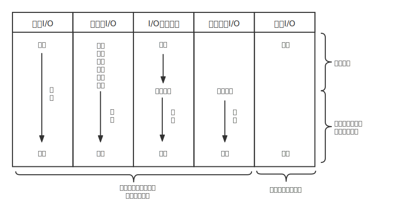

[TOC]

# IO模型

再了解IO模型前，首先要说明几个概念：

1. 何为 I/O?

	I/O（Input/Outpu） 即输入／输出 。

2.  文件描述符（File descriptor） 

   在操作系统内，需要借助一个号码能够找到文件，这个号码就被成为文件描述符。举个例子，我们在餐厅排队取号之后，服务员会根据取号的号码找到我们。

3. 用户空间和内核空间

     

   一个进程的地址空间划分为 用户空间（User space） 和 内核空间（Kernel space ）。

   我们的应用程序都是运行在用户空间，不能直接访问内核空间。

   应用程序想要执行 IO 操作的话，必须通过 系统调用 来间接系统资源。

   也就是说，我们的应用程序实际上只是发起了 IO 操作的调用而已，具体 IO 的执行是由操作系统的内核来完成的。

   所以当我们查看java.nio 包源码的时候会发现，应用程序都是通过系统调用执行 IO 操作。

4. IO读写的底层流程

 应用程序发起的一次IO操作实际包含两个阶段：

1. IO调用阶段：应用程序进程向内核发起系统调用
2. IO执行阶段：内核执行IO操作并返回
   1. 准备数据阶段：内核等待I/O设备准备好数据
   2. 拷贝数据阶段：将数据从内核缓冲区拷贝到用户空间缓冲区

## Unix IO模型

前面说了那么多，想必现在应该知道 I/O 是怎么一回事了，接着再瞧瞧啥叫阻塞啥叫同步。

UNIX 系统下， IO 模型一共有 5 种：**同步阻塞 I/O**、**同步非阻塞 I/O**、**I/O 多路复用**、**信号驱动 I/O** 和**异步 I/O**。

#### 1. 阻塞 IO - 同步阻塞

  

同步阻塞 IO 模型中，应用程序发起 recvform 调用后，会一直阻塞，直到在内核把数据拷贝到用户空间。

在高并发环境中，阻塞IO会占用大量线程，而线程的维护非常消耗资源，影响系统吞吐量。

#### 2. 非阻塞 - 同步非阻塞

  

相比于同步阻塞 IO 模型，同步非阻塞 IO 模型确实有了很大改进。

用户进程循环调用recvfrom函数，询问内核是否准备好数据，

当数据没准备好则，返回 `EWOULDBLOCK`错误码，避免一直阻塞。如果准备好了，将数据从内核复制到用户空间，返回数据。

但是，这种 IO 模型同样存在问题：**应用程序不断进行 I/O 系统调用轮询数据是否已经准备好的过程是十分消耗 CPU 资源的。**

这个时候，**I/O 多路复用模型** 就上场了。

#### 3. 信号驱动 - 同步非阻塞

前一个非阻塞模型中，需要调用者轮询，怎么避免呢？

首先要开启 socket 的信号驱动式 IO 功能，应用进程通过 sigaction 系统调用注册 SIGIO 信号处理函数，该系统调用会立即返回。当数据准备好时，内核会为该进程产生一个 SIGIO 信号通知，之后再把数据拷贝到用户空间中。

这也是**同步非阻塞**。虽然等待数据期间用户态进程不被阻塞，但当收到信号通知时是阻塞并拷贝数据，所以还是同步的。

#### 4. 多路复用 - 同步阻塞

 

 IO多路复用也称事件驱动IO。

一句话解释多路复用：多个文件描述符（Socket）复用一个线程来监听

在内核中，通过 select 、poll、epoll函数监听多个文件描述符，当某个文件描述符就绪了，就通知用户进程复制数据。

IO 多路复用模型中，线程首先发起 select 调用，select询问内核内的文件描述符数据是否准备就绪，等内核把数据准备好了，用户线程再发起 recvfrom 调用接收数据。read 调用的过程（数据从内核空间->用户空间）还是阻塞的。

**IO 多路复用模型，通过减少无效的系统调用，减少了对 CPU 资源的消耗，在单个线程里同时监控多个套接字。**

**IO 复用的特点是进行了两次系统调用，进程先是阻塞在 select 上，再阻塞在读操作的第二个阶段上**。这是**同步阻塞**的。

|            |                       select                       |                       poll                       |                            epoll                             |
| :--------- | :------------------------------------------------: | :----------------------------------------------: | :----------------------------------------------------------: |
| 操作方式   |                        遍历                        |                       遍历                       |                             回调                             |
| 底层实现   |                        数组                        |                       链表                       |                            红黑树                            |
| IO效率     |      每次调用都进行线性遍历，时间复杂度为O(n)      |     每次调用都进行线性遍历，时间复杂度为O(n)     | 事件通知方式，每当fd就绪，系统注册的回调函数就会被调用，将就绪fd放到readyList里面，时间复杂度O(1) |
| 最大连接数 |              1024（x86）或2048（x64）              |                      无上限                      |                            无上限                            |
| fd拷贝     | 每次调用select，都需要把fd集合从用户态拷贝到内核态 | 每次调用poll，都需要把fd集合从用户态拷贝到内核态 |  调用epoll_ctl时拷贝进内核并保存，之后每次epoll_wait不拷贝   |

#### 5. 异步IO - 异步非阻塞

 

如图， 用户进程在发起调用后，内核会立即返回。接着用户进程就干别的事去了。

然后内核等待数据准备完毕，自动将数据拷贝到用户内存，接着给用户进程发了个信号，通知 IO 操作已完成，这才是五个 I/O 模型中唯一一个异步模型。

可能会有疑问，为啥信号驱动模型是同步模型，这是因为信号驱动是由内核通知何时启动一个 IO 操作，还需要用户进程再拷贝数据。而异步 IO 是由内核是在所有工作做完后，通知 IO 操作已完成。

异步 IO 特点是 IO 执行的两个阶段（等待数据、拷贝数据）都由内核去完成，用户进程无需干预，也不会被阻塞。这就是异步非阻塞了。也就是 Java 中的 AIO。

Java 7 中引入了 NIO 的改进版 NIO 2,它是异步 IO 模型。

异步 IO 是基于事件和回调机制实现的，也就是应用操作之后会直接返回，不会堵塞在那里，当后台处理完成，操作系统会通知相应的线程进行后续的操作。

目前来说 AIO 的应用还不是很广泛。Netty 之前也尝试使用过 AIO，不过又放弃了。这是因为，Netty 使用了 AIO 之后，在 Linux 系统上的性能并没有多少提升。

#### 6. 总结比较

 

## FAQ

## 参考

-  [如何完成一次 IO – 栖迟於一丘 (llc687.top)](https://llc687.top/126.html) 
-  [10分钟看懂， Java NIO 底层原理 - 疯狂创客圈 - 博客园 (cnblogs.com)](https://www.cnblogs.com/crazymakercircle/p/10225159.html) 

